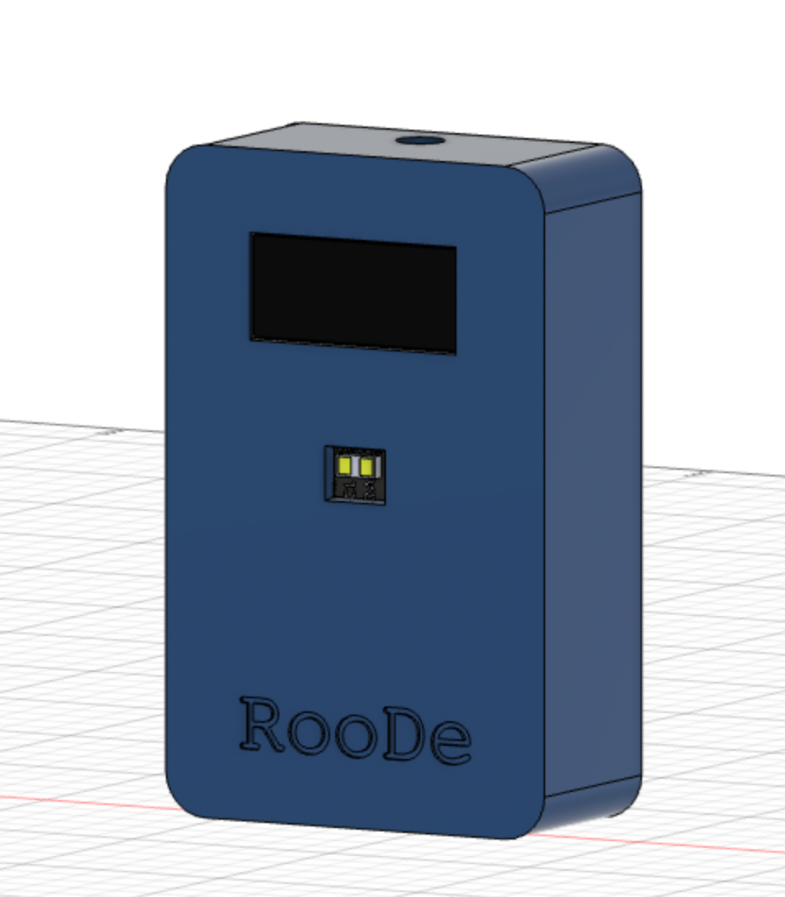

# RooDe

People counter working with any smart home system which supports ESPHome and therefore Home Assistamt. All necessary entities are created automatically.

## Algorithm
The implemented Algorithm is an improved version of my own implementation which checks the direction of a movement through two defined zones. ST implemented a nice and efficient way to track the path from one to the other direction. I migrated the algorigthm with some changes into the Roode project. 
The concept of path tracking is the detecion of a human:
* In the first zone only
* In both zones 
* In the second zone only
* In no zone

That way we can ensure the direction of movement.

The sensor creates a 16x16 grid and the final distance is computed by taking the average of the distance of the values of the grid.
We are defining two different Region of Interest (ROI) inside this grid. Then the sensor will measure the two distances in the two zones and will detect any presence and tracks the path to receive the direction. 

However, the algorithm is very sensitive to the slightest modification of the ROI, regarding both its size and its positioning inside the grid.

ST Microelectronics define the values for the parameters as default like this:
- `ROI_width = 8 //min 4`
- `ROI_height = 16 //min 4`
- `center = {167,231}`

The center of the ROI you set is based on the table below and the optical center has to be set as the pad above and to the right of your exact center:

Set the center SPAD of the region of interest (ROI)
based on VL53L1X_SetROICenter() from STSW-IMG009 Ultra Lite Driver

ST user manual UM2555 explains ROI selection in detail, so we recommend
reading that document carefully. Here is a table of SPAD locations from
UM2555 (199 is the default/center):

128,136,144,152,160,168,176,184,  192,200,208,216,224,232,240,248
129,137,145,153,161,169,177,185,  193,201,209,217,225,233,241,249
130,138,146,154,162,170,178,186,  194,202,210,218,226,234,242,250
131,139,147,155,163,171,179,187,  195,203,211,219,227,235,243,251
132,140,148,156,164,172,180,188,  196,204,212,220,228,236,244,252
133,141,149,157,165,173,181,189,  197,205,213,221,229,237,245,253
134,142,150,158,166,174,182,190,  198,206,214,222,230,238,246,254
135,143,151,159,167,175,183,191,  199,207,215,223,231,239,247,255

127,119,111,103, 95, 87, 79, 71,   63, 55, 47, 39, 31, 23, 15,  7
126,118,110,102, 94, 86, 78, 70,   62, 54, 46, 38, 30, 22, 14,  6
125,117,109,101, 93, 85, 77, 69,   61, 53, 45, 37, 29, 21, 13,  5
124,116,108,100, 92, 84, 76, 68,   60, 52, 44, 36, 28, 20, 12,  4
123,115,107, 99, 91, 83, 75, 67,   59, 51, 43, 35, 27, 19, 11,  3
122,114,106, 98, 90, 82, 74, 66,   58, 50, 42, 34, 26, 18, 10,  2
121,113,105, 97, 89, 81, 73, 65,   57, 49, 41, 33, 25, 17,  9,  1
120,112,104, 96, 88, 80, 72, 64,   56, 48, 40, 32, 24, 16,  8,  0 <- Pin 1

This table is oriented as if looking into the front of the sensor (or top of
the chip). SPAD 0 is closest to pin 1 of the VL53L1X, which is the corner
closest to the VDD pin on the Pololu VL53L1X carrier board:

  +--------------+
  |             O| GPIO1
  |              |
  |             O|
  | 128    248   |
  |+----------+ O|
  ||+--+  +--+|  |
  |||  |  |  || O|
  ||+--+  +--+|  |
  |+----------+ O|
  | 120      0   |
  |             O|
  |              |
  |             O| VDD
  +--------------+

However, note that the lens inside the VL53L1X inverts the image it sees
(like the way a camera works). So for example, to shift the sensor's FOV to
sense objects toward the upper left, you should pick a center SPAD in the
lower right.

#### Threshold distance

Another crucial choice is the one corresponding to the threshold. Indeed a movement is detected whenever the distance read by the sensor is below this value. The code contains a vector as threshold, as one (as myself) might need a different threshold for each zone.

The SparkFun library also supports more formats for the threshold: for example one can set that a movement is detected whenever the distance is between two values. However, more information for the interested reader can be found on the corresponding page.

With the updated code (however only for esp32 at the moment) the threshold is automatically calculated by the sensor. To do so it is necessary to position the sensor and, after turning it on, wait for 10 seconds without passing under it. After this time, the average of the measures for each zone will be computed and the thereshold for each ROI will correspond to 80% of the average value. Also the value of 80% can be modified in the code, by editing the variable `threshold_percentage`

The calibration of the threshold can also be triggered by a MQTT message. An example for doing so is in the file `integration_with_home_assistant.md`.

## Useful links

[SparkFun library guide](https://learn.sparkfun.com/tutorials/qwiic-distance-sensor-vl53l1x-hookup-guide/all) with more information about the functions used in the code

## Hardware
There will be a specific Hardware setup (recommended brands etc.) soon!
* ESP8266 or ESP32 (Wemos D1 mini case will be available)
* 1x VL53L1X (GY-53 and cheap chinese sensors)
* Optional HC-SR501
* Optional 128x32 OLED
* Power Supply
* Encolsure (see .stl files) - will be updated soon!
Pins:
SDA_PIN D2 or 21 (ESP32)
SCL_PIN D1 or 22 (ESP32)

## Configuration
### ESPHome
Configue at least the secrets.yaml with your wifi SSID and password to connect. Check the peopleCounter.yaml to adapt the exposed sensors to your needs.

### Entry/Exit inverted:
Set INVERT_DIRECTION to true or false to invert the direction.

## Configuration
Be sure to configure your wifi credentials and adapt the global variables to set everyhting to your needs.
The most important config part is the calibration mode. You have two different calibration modes available:
Calibration v1 calibrates the distance for one zone and calculates the standard deviation and uses that value for both zones. 
Calibration v2 calibrates both zones individually (thanks to @andrea-fox). 

## Changelog
### Changelog v1.0
#### Additions and Breaking Changes
* ESPHome (thanks to @diplix)
* Removes legacy support which includes
   * Arduino plattform
   * MySensors plattform
   * **Non** VL53L1X-Sensors
* VL531L1X TOF Sensor with configurable ROI zones for one-sensor-solution
* Counting people entering and leaving a room with path tracking for improved accuracy
* Sensor threhsold calibration for each zone
* Receiving commands from the the controller e.g softreset
* OLED support (coming in 1.1)
* Sleep mode with Motion Sensor support (coming in 1.1)
* Firmware upgrades over WebUI (esphome)

   
### Changelog v0.9.6
#### Additions
* added full VL53L0X support
* Added OLED brightness config option
* Updated to MySensors@2.3.1
#### Bugfixes and other changes
* measruing speed improvements 
* Fixed receiving and sending message issues
* General bug fixes and improvements
* Changed default PA_LEVEL to HIGH

### Changelog v0.9.5
* Added VL53L0X support
    * Using the Pololu VL53XXX Library
* Huge Code refactor

### Changelog v0.9.4-alpha2:
* added incomplete push button support
    * There is a need of 2 spare interrupt PINS
    * May be working with PinChangeInterrupt library
* minor bugfixes
* rename send() function and changed signature
### Changelog v0.9.4-beta:
* changed IR-calibration hardcoded value to THRESHOLD_X 
* CALIBRATION_VAL to 4000
### Changelog v.0.9.4-release
* Added standard deviation threhsold calculation
* Removed constant THRESHOLD_X